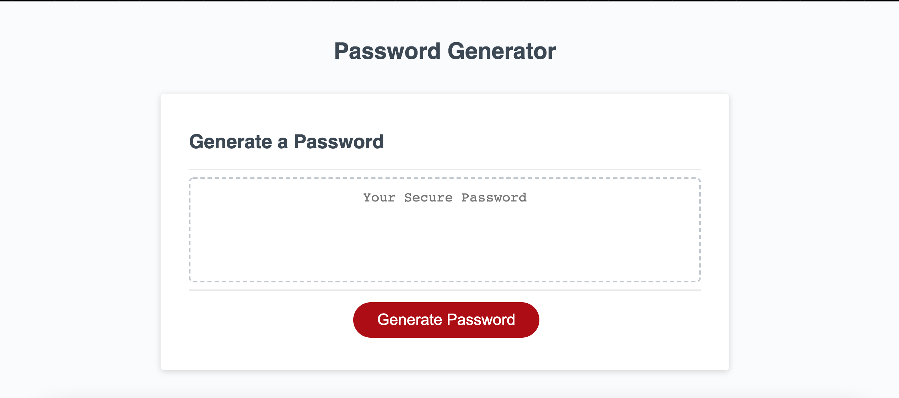
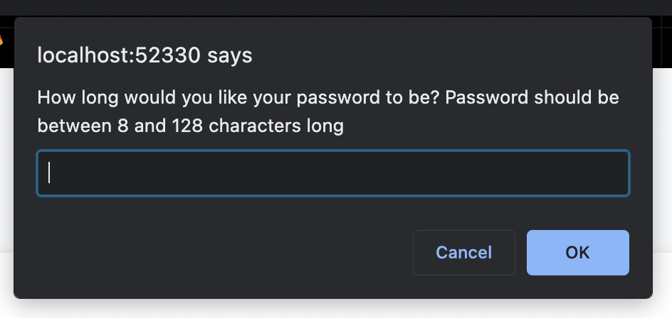
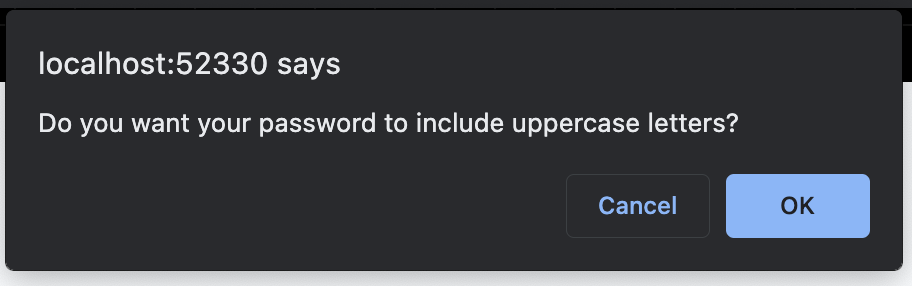
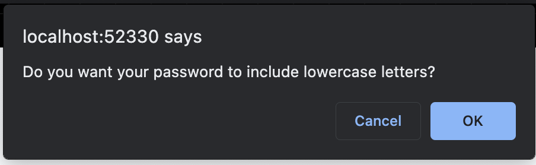
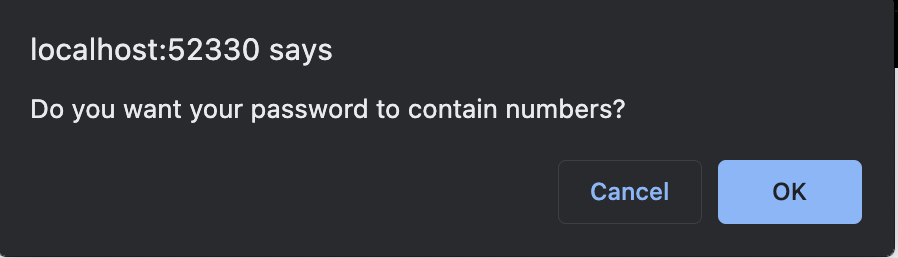
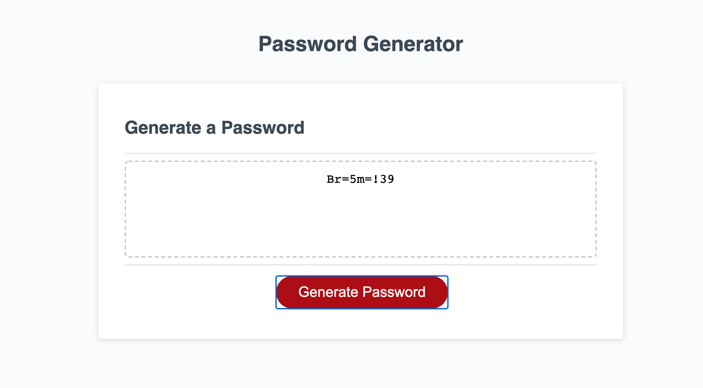
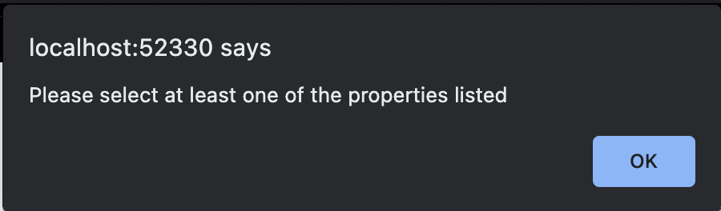

# Password-Generator-RS

## Overview

---

The project was created to show how a password generator can be made using Javascript, HTML, and CSS. Javascript is what gives the page it's functionality. A user can generate a password with the desired characters they would like and the desired password length.

## Instructions

---

- User would press 'Generate Password" button 

- A series of prompts will appear for the user to select the characteristics for the password they want to be gereated

- User must first select the length of the password. Password must be between 8 and 128 characters long. 

- User will need to select 'OK' if they would like an uppercase letters to be used in the password or 'Cancel' if they do not. 

- User will need to select 'OK' if they would like lowercase letters in their password or 'Cancel' if they do not. 

- User will need to select 'OK' if they would like special character in their password or 'Cancel' if they do not. 

- User will need to select 'OK' if they would like numbers in their password or 'Cancel' if they do not. 

-If user selects 'OK' for all characters a password like this would be generated: 

-If user does not select at least one property a prompt will appear to let them know to pick at least one characteristic for their password. 

# Submission:

---

- [Deployed URL](https://rudys212.github.io/Password-Generator-RS/)

- [GitHub URL](https://github.com/Rudys212/Password-Generator-RS)
